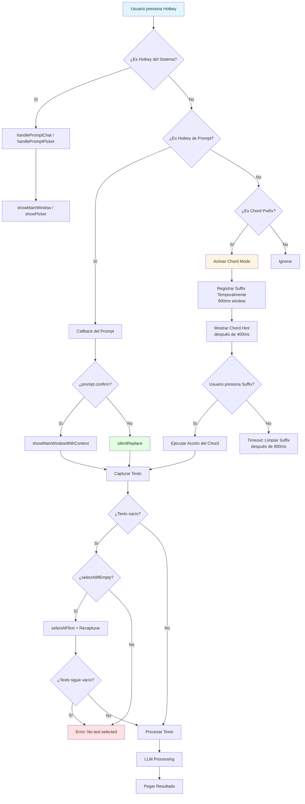
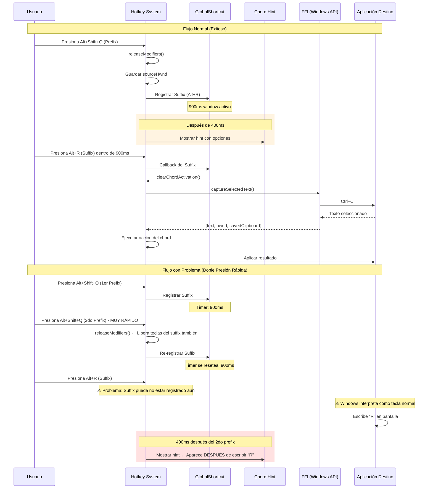
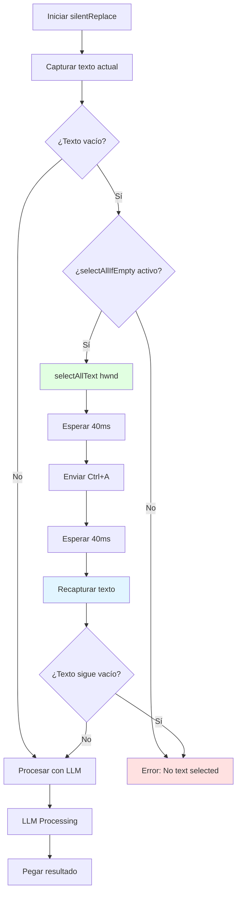
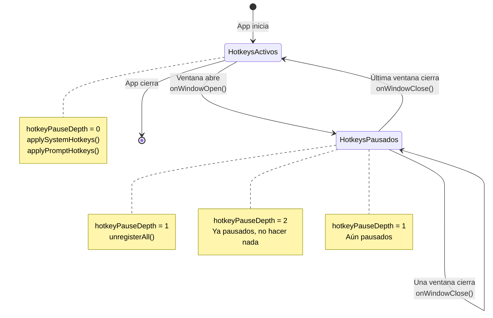
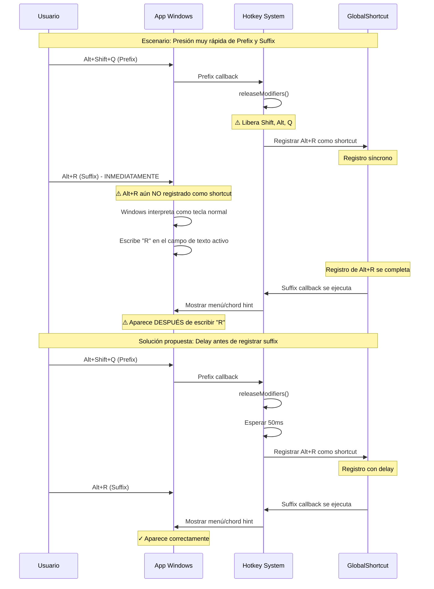
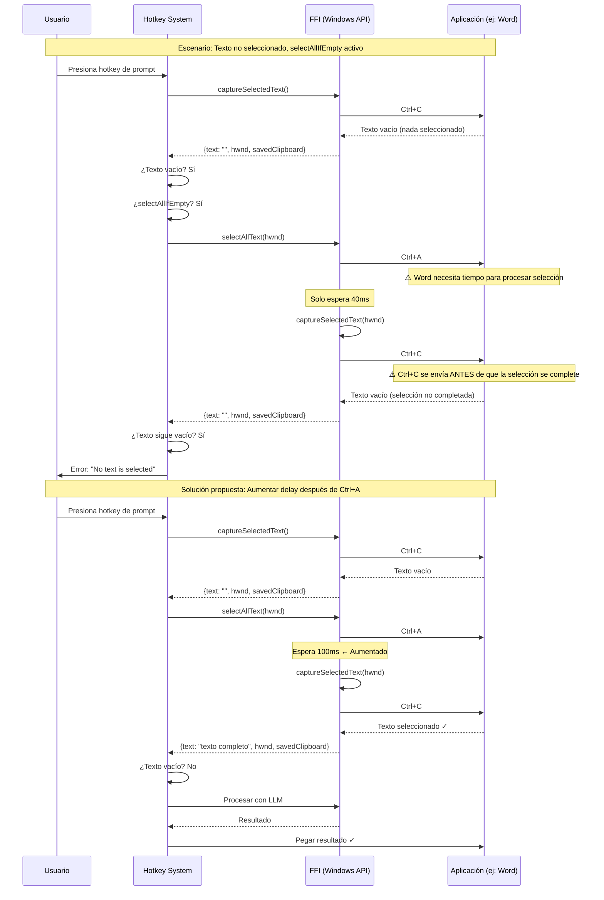
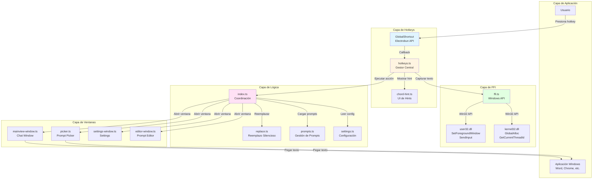

# Diagramas de Flujos de Hotkeys

## Diagrama 1: Flujo General del Sistema de Hotkeys



---

## Diagrama 2: Flujo Detallado de Chord Hotkey



---

## Diagrama 3: Flujo de selectAllIfEmpty



---

## Diagrama 4: Flujo de Pausa/Reanudación de Hotkeys



---

## Diagrama 5: Flujo de Captura de Texto (FFI)

```mermaid
flowchart TD
    A[captureSelectedText hwnd] --> B[Leer clipboard actual]
    B --> C[Limpiar clipboard]
    C --> D[releaseModifiers]
    D --> E[AttachThreadInput<br/>si es necesario]
    E --> F[SetForegroundWindow hwnd]
    F --> G[Esperar 80ms]
    
    G --> H[Intento 1/2]
    H --> I[Verificar ventana activa]
    I --> J[Limpiar clipboard]
    J --> K[Enviar Ctrl+C]
    K --> L[Leer clipboard con polling<br/>4 intentos, 75ms cada uno]
    L --> M{¿Texto no vacío?}
    
    M -->|Sí| N[Salir del loop]
    M -->|No| O{¿Más intentos?}
    O -->|Sí| P[Esperar 60ms]
    P --> H
    O -->|No| N
    
    N --> Q[Desadjuntar ThreadInput]
    Q --> R[Restaurar clipboard original]
    R --> S[Retornar {text, hwnd, savedClipboard}]
    
    style K fill:#fff4e1
    style L fill:#e1f5ff
```

---

## Diagrama 6: Problema de Timing en Chord (Issue 2.2)



---

## Diagrama 7: Problema de selectAllIfEmpty (Issue 3.1)



---

## Diagrama 8: Arquitectura del Sistema de Hotkeys



---

## Diagrama 9: Timeline de un Chord Exitoso vs Fallido

```mermaid
gantt
    title Timeline de Chord Hotkey
    dateFormat X
    axisFormat %L ms
    
    section Chord Exitoso
    Presionar Prefix (Alt+Shift+Q) :a1, 0, 50
    releaseModifiers() :a2, 50, 10
    Registrar Suffix (Alt+R) :a3, 60, 20
    Esperar 400ms :a4, 80, 400
    Mostrar Chord Hint :a5, 480, 50
    Presionar Suffix (Alt+R) :a6, 600, 50
    Ejecutar Acción :a7, 650, 100
    
    section Chord Fallido (Presión Rápida)
    Presionar Prefix (Alt+Shift+Q) :b1, 0, 50
    releaseModifiers() :b2, 50, 10
    Registrar Suffix (Alt+R) :b3, 60, 20
    Presionar Prefix (Alt+Shift+Q) :b4, 80, 50
    releaseModifiers() :b5, 130, 10
    Re-registrar Suffix (Alt+R) :b6, 140, 20
    Presionar Suffix (Alt+R) :b7, 160, 50
    ⚠️ Suffix no registrado aún :crit, 160, 50
    Windows escribe "R" :crit, 160, 50
    Esperar 400ms :b8, 180, 400
    Mostrar Chord Hint :b9, 580, 50
    ⚠️ Aparece después de escribir "R" :crit, 580, 50
```



---

## Diagrama 10: Estado de ChordPrefixes

```mermaid
stateDiagram-v2
    [*] --> Inactivo
    
    Inactivo --> PrefixPresionado: Alt+Shift+Q
    note right of PrefixPresionado: actions: Map vacío<br/>timer: null<br/>hintTimer: null<br/>sourceHwnd: null
    
    PrefixPresionado --> SuffixRegistrados: Registrar suffixes
    note right of SuffixRegistrados: actions: {Alt+R → callback}<br/>timer: 900ms<br/>hintTimer: 400ms<br/>sourceHwnd: ventana activa
    
    SuffixRegistrados --> HintVisible: 400ms pasan
    note right of HintVisible: Mostrar ventana de hint
    
    HintVisible --> SuffixEjecutado: Alt+R presionado
    note right of SuffixEjecutado: clearChordActivation()<br/>Ejecutar callback
    
    SuffixRegistrados --> Timeout: 900ms pasan
    note right of Timeout: clearChordActivation()
    
    SuffixRegistrados --> PrefixPresionado: Alt+Shift+Q de nuevo
    note right of PrefixPresionado: ⚠️ Timer se resetea<br/>Suffix se re-registran
    
    SuffixEjecutado --> Inactivo
    Timeout --> Inactivo
    
    note right of SuffixRegistrados
    Posible Issue: Si prefix se presiona dos veces
    rápidamente, el timer se resetea y los
    suffix se re-registran, causando confusión
    end note
```

---

## Notas sobre los Diagramas

### Diagrama 1: Flujo General
Muestra la ruta principal desde que el usuario presiona un hotkey hasta que se ejecuta la acción. Los colores indican:
- 🔵 Azul: Inicio del flujo
- 🟡 Amarillo: Chord mode
- 🟢 Verde: Reemplazo silencioso
- 🔴 Rojo: Error

### Diagrama 2: Flujo de Chord
Compara el flujo exitoso con el flujo problemático de doble presión. El área naranja muestra el timing crítico.

### Diagrama 3: selectAllIfEmpty
Muestra el flujo de selección automática cuando no hay texto seleccionado. El área roja indica el punto de fallo.

### Diagrama 4: Pausa/Reanudación
Muestra cómo el sistema maneja múltiples ventanas abiertas usando un contador de profundidad.

### Diagrama 5: Captura de Texto
Detalle del proceso de captura vía FFI, incluyendo los reintentos y polling del clipboard.

### Diagrama 6: Problema de Timing
Ilustra visualmente el Issue 2.2 y la solución propuesta con delay.

### Diagrama 7: Problema de selectAllIfEmpty
Muestra por qué selectAllIfEmpty falla y cómo el aumento de delay lo soluciona.

### Diagrama 8: Arquitectura
Vista general de las capas del sistema y sus interacciones.

### Diagrama 9: Timeline
Compara visualmente el timing de un chord exitoso vs fallido.

### Diagrama 10: Estado de ChordPrefixes
Máquina de estados que muestra las transiciones del sistema de chords.
